# LR6
Лабораторная работа №6

# Система контроля версий

### Цель лабораторной работы
Изучение базовых возможностей системы управления версиями, опыт работы с Git Api, опыт работы с локальным и удаленным репозиторием.

# Порядок выполнения работы:
#### 1.Создать аккаунт на сайте GitHub.
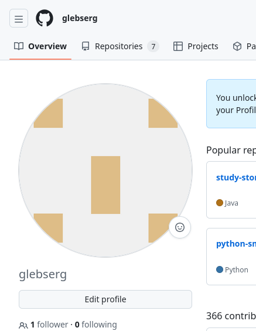

#### 2.Сделать копию в личное хранилище из https://github.com/Kurtyanik/LR6/ (Fork).
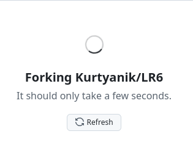

#### 3.Установить Git (https://git-scm.com/).
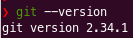

#### 4.После установки настроить клиент git, введя имя пользователя (Группа Фамилия И.О.) и email.
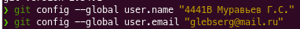

#### 5.Клонировать свой личный удалённый репозиторий на компьютер.
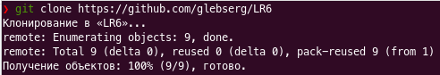

#### 6.Добавить файл через интерфейс GitHub. Подтянуть изменения в локальный репозиторий. Работу продолжать локально.
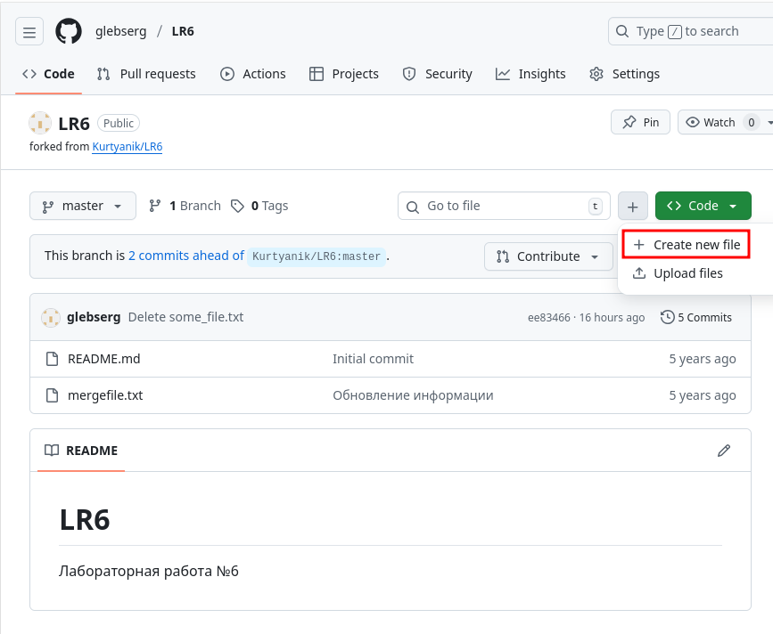
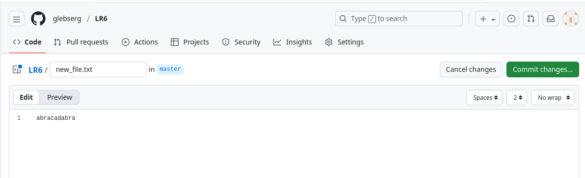
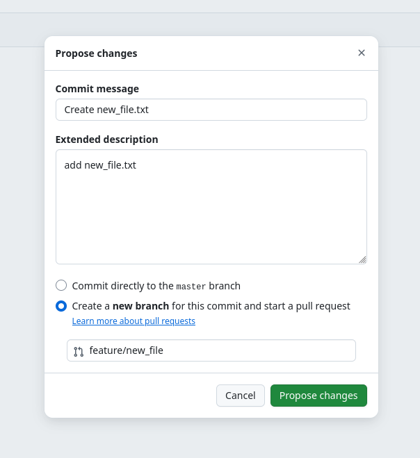

#### 7.Получить историю операций для каждой из веток.
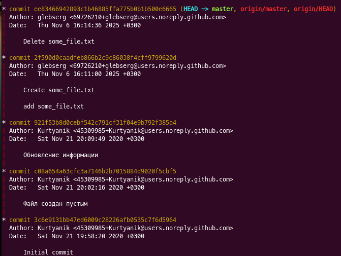

#### 8.Просмотреть последние изменения.
#### 9.Выполнить слияние в ветку master, разрешив конфликт (можно использовать специальные редакторы или графический интерфейс git).
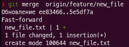

#### 10.Удалить побочную ветку после успешного слияния.
Удаляется автоматически
#### 11.Сделать изменения и зафиксировать их, оставляя комментарии, несколько раз.
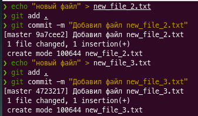

#### 12.Сделать откат коммита.

#### 13.Создать ветку для отчёта.
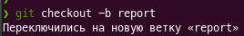

#### 14.Начать оформлять отчёт в файле README.md (разрешены сторонние редакторы с подсветкой синтаксиса), используя markdown синтаксис (https://guides.github.com/features/mastering-markdown/):  В отчёте должен быть снимки экрана консоли и сторонних программ. Файлы снимков экрана разместить в отдельной папке.  Лог команд (без результатов их выполнения). При написании отчёта периодически делать коммиты, не забывать комментировать.
#### 15.Получить историю операций в форматированном виде (сокращённый хэш + дата + имя автора + комментарий). Добавить её в отчёт и сделать финальную фиксацию изменений.
#### 16.Отправить локальные изменения в сетевое хранилище GitHub (если делаете работу постепенно, то синхронизацию проводить в конце рабочего сеанса)